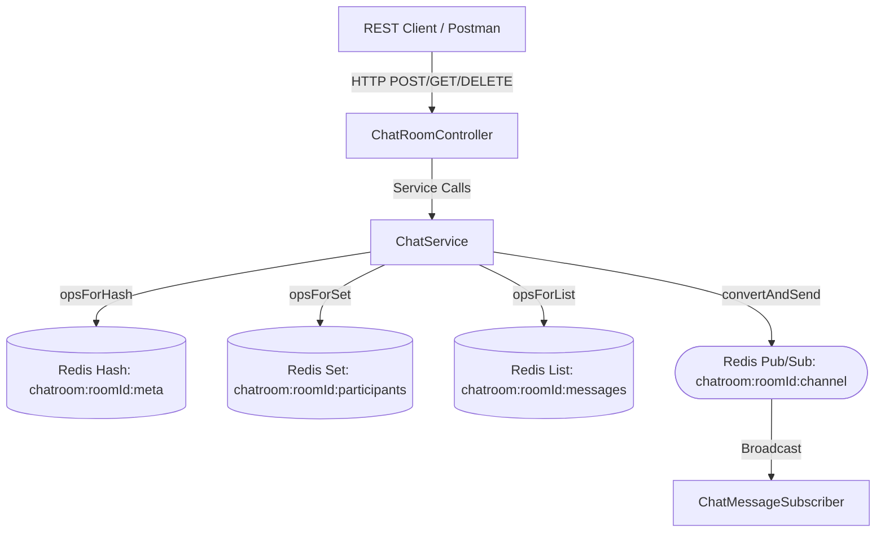

# Simple Chat Application Using Redis

An enterprise-ready, REST-compliant Spring Boot 3 backend application implementing a real-time chat application with **Redis** as the primary data store and messaging engine.

Developed as a backend assignment for **Freightfox**.

**Live base URL:** [https://freight-fox-chat-application-using-redis.onrender.com/](https://freight-fox-chat-application-using-redis.onrender.com/)

---

## 📑 Table of Contents
- [Architecture & Design Decisions](#architecture--design-decisions)
- [Redis Data Structures Used](#redis-data-structures-used)
- [API Specifications](#api-specifications)
- [Error Handling & Edge Cases](#error-handling--edge-cases)
- [Running the Project](#running-the-project)
  - [Prerequisites](#prerequisites)
  - [Option 1: Run with Docker Compose (Recommended)](#option-1-run-with-docker-compose-recommended)
  - [Option 2: Run Locally with External/Local Redis](#option-2-run-locally-with-externallocal-redis)
- [Running Automated Tests](#running-automated-tests)
- [Testing with Postman](#testing-with-postman)
- [Persistence & Durability](#persistence--durability)
- [Project Structure](#project-structure)

---

## Architecture & Design Decisions

### "Why" Before "How"
1. **Memory-First Data Store**: Redis operates in-memory with sub-millisecond read/write latencies, making it the industry standard for high-throughput chat systems.
2. **Dedicated Subdirectory Isolation**: Scaffolding the project in `simple-chat-app/` keeps it cleanly separated from the root workspace, avoiding Maven dependency conflicts and keeping the git tree modular.
3. **Decoupled Real-Time Messaging**: Using Redis Pub/Sub decouples publishers from active listeners, allowing instant real-time message distribution across multiple application instances without polling.
4. **Idempotency & Clean Boundaries**: REST endpoints follow standard conventions (201 for creation, 200 for operations/history, 404 for missing rooms, 409 for duplicates, and 400 for validation errors).



---

## Redis Data Structures Used

| Requirement | Redis Data Structure | Redis Key Pattern | Reason / Justification |
| :--- | :--- | :--- | :--- |
| **Chat Room Metadata** | **Hash** | `chatroom:{roomId}:meta` | $O(1)$ property access (`roomId`, `roomName`, `createdAt`) without deserializing the whole object. |
| **Participants** | **Set** | `chatroom:{roomId}:participants` | Unique membership (idempotent user join) with $O(1)$ presence check (`SISMEMBER`) and cardinality (`SCARD`). |
| **Message History** | **List** | `chatroom:{roomId}:messages` | Ordered timeline storage via `RPUSH`. `LRANGE key -N -1` fetches the last $N$ messages in $O(N)$ preserving chronological order. |
| **Real-Time Messaging** | **Pub/Sub** | `chatroom:{roomId}:channel` | Zero-latency event broadcast to all active subscribers without database polling. |
| **Active Rooms Index** | **Set** | `chatrooms:all` | $O(1)$ duplicate room name prevention and room directory listing. |

---

## API Specifications

**Base URL:** `https://freight-fox-chat-application-using-redis.onrender.com/`

All endpoints below are relative to that host (example: `https://freight-fox-chat-application-using-redis.onrender.com/api/chatapp/chatrooms`).

Local Docker/Maven runs still use `http://localhost:8080/`.

### 1. Create a Chat Room
- **Method & URL**: `POST /api/chatapp/chatrooms`
- **Request Body**:
  ```json
  {
    "roomName": "general"
  }
  ```
- **Response** (`201 Created`):
  ```json
  {
    "message": "Chat room 'general' created successfully.",
    "roomId": "general",
    "status": "success"
  }
  ```

---

### 2. Join a Chat Room
- **Method & URL**: `POST /api/chatapp/chatrooms/{roomId}/join`
- **Example URL**: `POST /api/chatapp/chatrooms/general/join`
- **Request Body**:
  ```json
  {
    "participant": "guest_user"
  }
  ```
- **Response** (`200 OK`):
  ```json
  {
    "message": "User 'guest_user' joined chat room 'general'.",
    "status": "success"
  }
  ```

---

### 3. Send a Message
- **Method & URL**: `POST /api/chatapp/chatrooms/{roomId}/messages`
- **Example URL**: `POST /api/chatapp/chatrooms/general/messages`
- **Request Body**:
  ```json
  {
    "participant": "guest_user",
    "message": "Hello, everyone!"
  }
  ```
- **Response** (`200 OK`):
  ```json
  {
    "message": "Message sent successfully.",
    "status": "success"
  }
  ```

---

### 4. Retrieve Chat History
- **Method & URL**: `GET /api/chatapp/chatrooms/{roomId}/messages?limit=10`
- **Example URL**: `GET /api/chatapp/chatrooms/general/messages?limit=10`
- **Response** (`200 OK`):
  ```json
  {
    "messages": [
      {
        "participant": "guest_user",
        "message": "Hello, everyone!",
        "timestamp": "2026-09-08T12:00:00Z"
      },
      {
        "participant": "another_user",
        "message": "Hi, guest_user!",
        "timestamp": "2026-09-08T12:01:00Z"
      }
    ]
  }
  ```

---

### 5. Delete a Chat Room (Optional Requirement)
- **Method & URL**: `DELETE /api/chatapp/chatrooms/{roomId}`
- **Example URL**: `DELETE /api/chatapp/chatrooms/general`
- **Response** (`200 OK`):
  ```json
  {
    "message": "Chat room 'general' deleted successfully.",
    "status": "success"
  }
  ```

---

### Additional Helper Endpoints
- **List All Rooms**: `GET /api/chatapp/chatrooms` (Returns all active rooms, metadata, and participant count)
- **List Room Participants**: `GET /api/chatapp/chatrooms/{roomId}/participants` (Returns array of active participant usernames)

---

## Error Handling & Edge Cases

| Scenario | HTTP Status | Response Format |
| :--- | :--- | :--- |
| **Duplicate Room Name** | `409 Conflict` | `{"message": "Chat room 'general' already exists.", "status": "error", "timestamp": "..."}` |
| **Non-Existent Room** | `404 Not Found` | `{"message": "Chat room 'general' does not exist.", "status": "error", "timestamp": "..."}` |
| **Blank / Invalid Input** | `400 Bad Request`| `{"message": "Validation failed: Room name cannot be empty or null", "status": "error", "timestamp": "..."}` |

---

## Running the Project

### Prerequisites
- **Java 17+**
- **Maven 3.8+**
- **Docker & Docker Compose** (optional, recommended)

### Option 1: Run with Docker Compose (Recommended)
This starts both Redis (with AOF persistence) and the Chat Application container with one command:
```bash
cd d:/code/Freightfox/simple-chat-app
docker compose up --build -d
```
The application will be accessible locally at `http://localhost:8080`.

The deployed API is at [https://freight-fox-chat-application-using-redis.onrender.com/](https://freight-fox-chat-application-using-redis.onrender.com/).

To stop the containers:
```bash
docker compose down
```

### Option 2: Run Locally with External/Local Redis
1. Start Redis on `localhost:6379` (e.g. via `docker run -d -p 6379:6379 redis:7.2-alpine --appendonly yes`).
2. Run the Spring Boot application from the `simple-chat-app` directory:
```bash
cd d:/code/Freightfox/simple-chat-app
mvn spring-boot:run
```

---

## Running Automated Tests

The test suite includes 20 comprehensive unit, service, and web slice tests covering:
1. **Test Case 1**: Room creation and join logic with Redis Hash and Set verification.
2. **Test Case 2**: Sending messages (List `RPUSH` + Pub/Sub broadcast) and chronological history retrieval (`LRANGE -limit -1`).
3. **Test Case 3**: Real-time Pub/Sub message receiving and parsing by `ChatMessageSubscriber`.
4. **Test Case 4**: Duplicate room names (`409 Conflict`) and non-existent room actions (`404 Not Found`).
5. **Test Case 5**: Chat room deletion purging all Redis keys.

To execute the test suite:
```bash
cd d:/code/Freightfox/simple-chat-app
mvn clean test
```

---

## Testing with Postman

A pre-configured Postman collection is included in the project:
📄 [SimpleChatApp.postman_collection.json](./SimpleChatApp.postman_collection.json)

The collection `baseUrl` variable is set to the live Render host:

`https://freight-fox-chat-application-using-redis.onrender.com`

For local testing, change `baseUrl` to `http://localhost:8080`.

### Steps to import and test:
1. Open Postman.
2. Click **Import** and select `SimpleChatApp.postman_collection.json`.
3. Confirm the collection variable `baseUrl` is `https://freight-fox-chat-application-using-redis.onrender.com`.
4. The collection provides the following requests pre-configured:
   - `1. Create Chat Room`
   - `2. Join Chat Room`
   - `3. Send Message 1`
   - `4. Send Message 2`
   - `5. Retrieve Chat History`
   - `6. List All Chat Rooms`
   - `7. Get Room Participants`
   - `8. Error Case - Duplicate Room`
   - `9. Error Case - Send to Non-existent Room`
   - `10. Delete Chat Room (Optional)`

---

## Persistence & Durability
To fulfill **Requirement 5 (Persistence)**:
Redis is configured with **Append-Only File (AOF)** persistence enabled (`--appendonly yes`) in `docker-compose.yml`.
- AOF logs every write operation received by the server, which can be replayed on startup to reconstruct the original dataset.
- The Redis data directory is mounted to a named Docker volume (`redis_chat_data`) to ensure messages and room metadata survive container restarts.

---

## Project Structure
```
simple-chat-app/
├── pom.xml                                   # Maven dependencies & build setup
├── Dockerfile                                # Multi-stage container build
├── docker-compose.yml                        # Redis (AOF) + Chat App service
├── SimpleChatApp.postman_collection.json     # Postman collection
├── README.md                                 # Full documentation
└── src/
    ├── main/
    │   ├── java/com/freightfox/chatapp/
    │   │   ├── SimpleChatApplication.java    # Spring Boot entry point
    │   │   ├── config/
    │   │   │   └── RedisConfig.java          # RedisTemplate, PubSub container configuration
    │   │   ├── controller/
    │   │   │   └── ChatRoomController.java   # REST controller for chatroom endpoints
    │   │   ├── dto/
    │   │   │   ├── request/                  # CreateRoom, JoinRoom, SendMessage requests
    │   │   │   └── response/                 # ApiResponse, ChatMessageDto, ChatHistoryResponse
    │   │   ├── exception/                    # GlobalExceptionHandler, custom exceptions
    │   │   ├── pubsub/
    │   │   │   └── ChatMessageSubscriber.java # Real-time Redis Pub/Sub listener
    │   │   └── service/                      # ChatService interface & ChatServiceImpl
    │   └── resources/
    │       └── application.properties        # Redis host/port & Jackson configurations
    └── test/
        └── java/com/freightfox/chatapp/
            ├── controller/
            │   └── ChatRoomControllerTest.java # WebMvc slice tests (status codes, validation)
            ├── pubsub/
            │   └── ChatMessageSubscriberTest.java # Redis Pub/Sub broadcast receiving tests
            └── service/
                └── ChatServiceTest.java        # Comprehensive service tests (TDD, Mockito)
```
